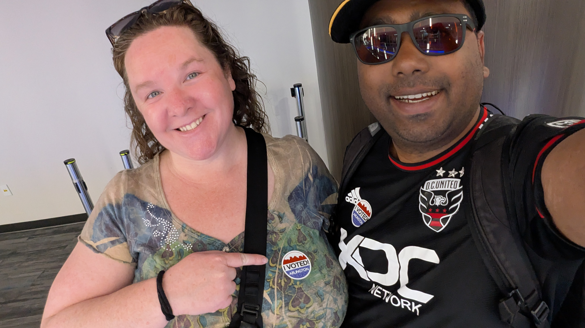

+++
date = '2026-04-20T11:22:14-04:00'
draft = false
title = 'Start of something new'
+++

## Introduction

Hey everyone, I recently quit my job to take a break and find something new. I am starting this blog to share my journey of the break as I tackle some side projects, be a full-time dad, and reflect on the current state of things in data engineering, civics, world politics and such.

Last Thursday, I took it a pretty easy as my wife and I 
- Voted in the Virginia elections to redistrict congressional map to counteract Republican enshittification of our electoral process
  

- Got massages
- Took our kid to the Nature Center Rock lesson. (The kiddo was mostly interested in throwing the rocks in the stream over the lesson)

- Dealt with a toddler meltdown as we planned too many things for the day and our son wasn't having it

On Friday,
- Had an interview with a recruiter, and even though I wasn't particularly looking forward to the interview, it turned out to be amazing as they thought my profile looked amazing for an organization that focuses on giving clients and activists local government data - which is right up my alley.

Over the weekend, we hosted my wonderful friends from college and their little 2 year old sweetheart daughter and had lots of fun. It was great to catch up with them after so long and share the joys and challenges of parenthood. And just tryig to survive in this crazy world in 2026.